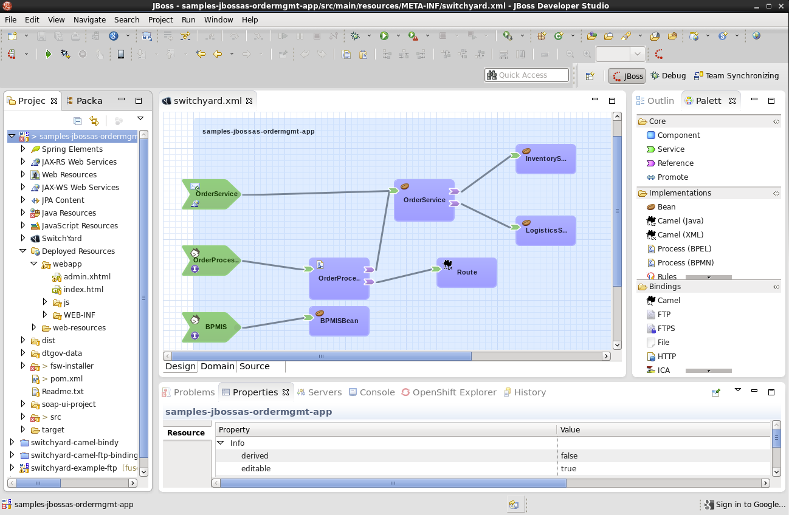
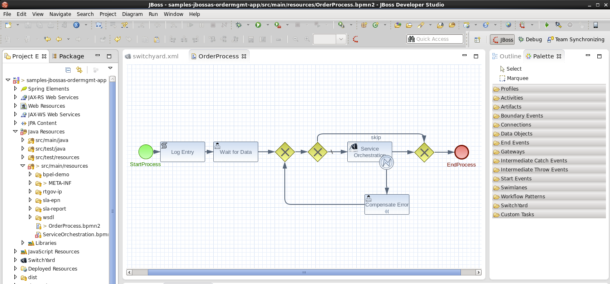
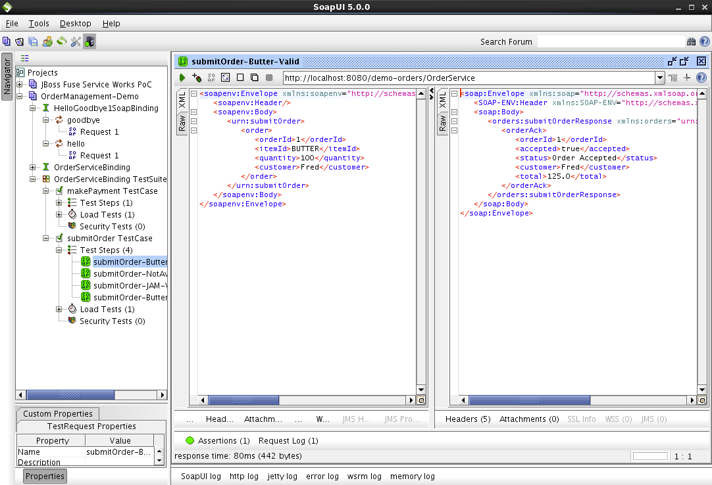
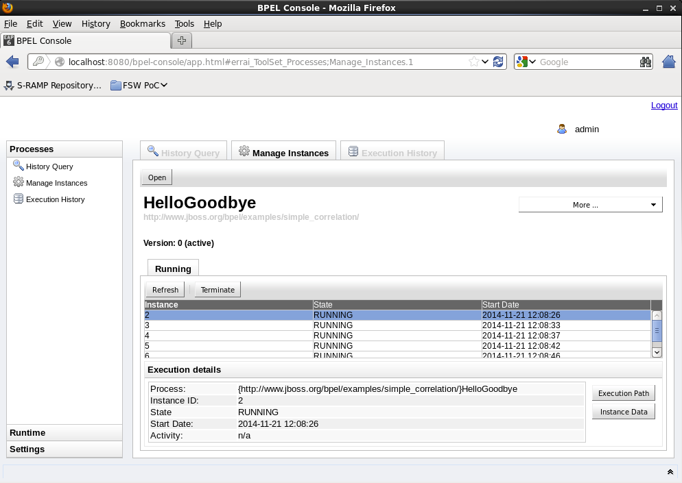
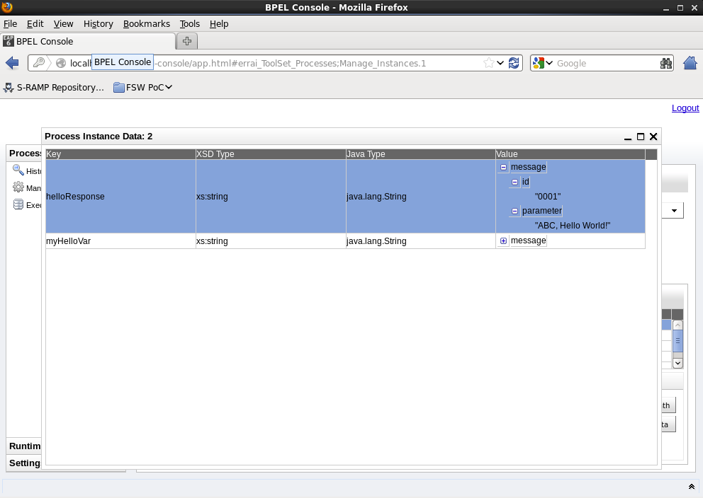
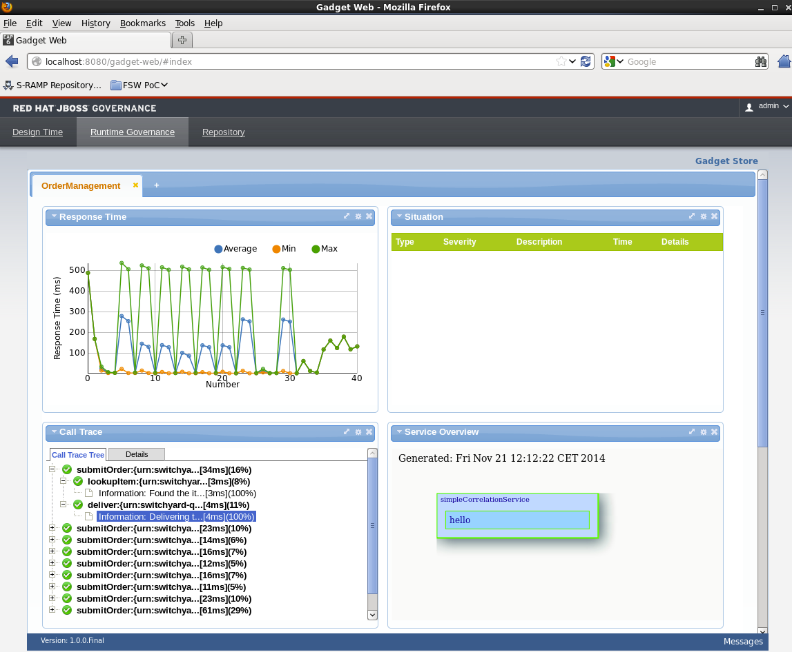
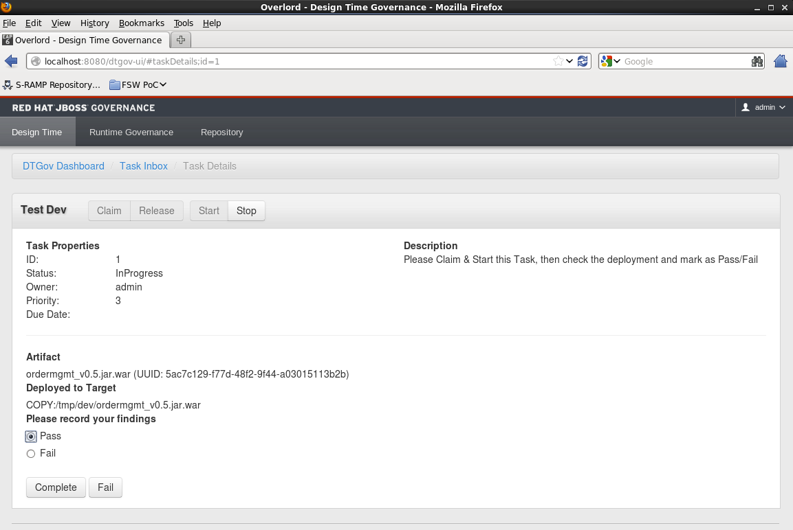
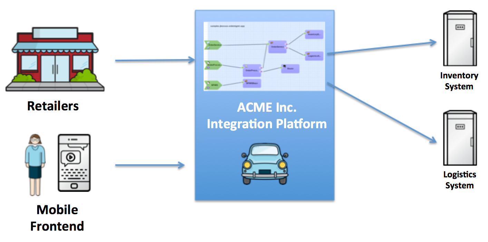

# Red Hat JBoss Fuse Service Works Showcase

# A. Synopsis

## What this is about
This repository includes a ready to use showcase for Red Hat's SOA integration suite named "JBoss Fuse Service Works" (see http://www.redhat.com/en/technologies/jboss-middleware/fuse-service-works for more information). The showcase demonstrates many of the key features that make JBoss Fuse Service Works one of the leading integration suites on the market. We focus especially the following:

* Integrate applications and services, handle business events, and automate business processes more efficiently (with BPEL and BPMN2).
* Create reusable and flexible business services.
* Control the life cycle of business services—from design to development to deployment—while adhering to defined policies and promoting reuse.
* View the business service metrics and proactively respond for efficient operations.


## Screenshots









# B. Installation

## 1. Prerequisites
1. Download Red Hat JBoss Fuse Service Works at http://www.jboss.org/download-manager/file/jboss-fsw-6.0.0.GA.zip
2. Download Red Hat JBoss Developer Studio at http://www.jboss.org/download-manager/file/jboss-devstudio-8.0.0.GA-jar_universal.jar
3. Download Soap UI at http://sourceforge.net/projects/soapui/files/latest/download
4. You can install Git on your machine to contribute code
5. Supported Operating Systems: Linux, MacOS

## 2. Installation

### 2.1 Install Red Hat JBoss Fuse Service Works

#### 2.1.1 Download and unzip this project
Download https://github.com/kai-wegner/fsw-the-showcase/archive/v0.8.5.zip and unzip it.
```
wget https://github.com/kai-wegner/fsw-the-showcase/archive/v0.8.5.zip
unzip v0.8.5.zip
mv fsw-the-showcase-0.8.5 fsw-the-showcase
```

#### 2.1.1 _(optional)_ Clone the showcase source code and start the installation script:

```
git clone git@github.com:kai-wegner/fsw-the-showcase.git
```

#### 2.1.2 Start the installation script
```
cd ./fsw-the-showcase/fsw-installer
./init.sh
```

#### 2.1.3 Install governance workflow component:

```
cd ./target
./startFSW.sh
./initDTGov.sh
```


3.0 After completing the installation wizard you will have a ready to run Fuse Service Works installation in the following path `./fsw-the-showcase/fsw-installer/target`.


#### Starting and stopping the server
You can start the server with the following command (if start script was created): `./target/startFSW.sh`

You can stop the server by pressing `CTRL-C`.


#### Links, usernames and default passwords

Component | Link
------------ | -------------
EAP Admin Console | http://localhost:9990/console/
Governance Console (DTGov, Overlord) | http://localhost:8080/overlord-idp/
BPEL Console | http://localhost:8080/bpel-console/

**Username**: admin
**Password**: jbossfsw1!


### 2.2 Install Red Hat JBoss Developer Studio

1. Install JBoss Developer Studio:

```
java -jar jboss-devstudio-8.0.0.GA-jar_universal.jar
```

### 2.3 Install Soap UI

1. Install Soap UI via the graphical installation wizard.


### 2.4 Setup JBDS workspace
DRAFT
Setup JBDS Workspace
Disable XML Schema Validation
Maven -> Update


# B. Walkthrough

## 1. Business scenario
ACME Inc. is one of the leading car part distributors working together with a huge number of retailers. ACME has already implemented the B2B communication with their retailers via Web Service technology. The processing of these B2B order requests is processed in a straight through manner, since ACME has existing contracts with them.

In the future ACME wants to expand their business from a single channel to a multi channel business. In this respect they especially would like to address end consumers via a modern mobile interface. Since this business is rather new for ACME, they are levering business process technology (BPMN) to implement a manual approval process.



## 2. Show developer view on the scenario

Start JBoss Developer Studio and explain the SwitchYard services:

#### OrderService
B2B Web Service
Case A) Laptop not in Inventory
Case B) Jam takes too long


#### OrderProcess
Manual Approval with Human Tasks (Log running process)


#### OrderProcessREST
Rest Interface for mobile devices


#### TBD - simpleCorrelationService
Show BPEL Console (http://localhost:8080/bpel-console/)


## 3. Execute the order scenario via the B2B interface
1. Start SOAP UI.
2. Open the test steps and execute them: `OrderManagement-Demo > OrderServiceBinding TestSuite > submitOrder TestCase`

## 4. Execute the oder scenario via the mobile interface
TBD - Mobile frontend is still under development.


## 5. Show the operational view on the scenario (Runtime Governance)
1. Open the Governance Console at http://localhost:8080/overlord-idp/ and open the "Runtime Governance" tab.
2. Setup Runtime Governance Dashboard
  * Go to "Gadget Store" and add all widgets.
  * Call Trace configure “0/1” TBD
3. Open SOAP UI and execute the testsuite a couple of times (> 5) to generate runtime data: `OrderManagement-Demo > OrderServiceBinding TestSuite`
4. Switch back to Governance Console and show results.


## 6. Show a sample governance workflow
tbd…


# C. Extending the showcase

## 1. Howto build the Service Works Application
TODO -  Build “ordermgmt_v0.5.jar.war”

## 2. Howto build the governance workflow
TODO
